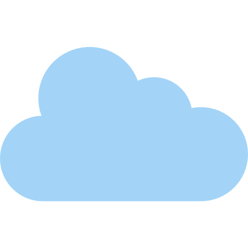

# Cloud



**Cloud Backup Manager for Google Drive** - A lightweight Windows daemon and GUI tool that automatically backs up your files and folders to Google Drive with real-time monitoring.


## Features

- **Real-time File Monitoring** - Automatically detects changes and backs up files instantly
- **Initial Backup** - Performs first-time backup immediately when started
- **Custom File Names** - Choose custom names for your backups on Google Drive
- **Auto-start** - Option to run automatically when Windows starts
- **Live Log Viewer** - Real-time logging with date-grouped display
- **Complete Control** - Start, stop, restart, or force kill the daemon from GUI
- **Multi-target Support** - Watch multiple folders/files simultaneously
- **Google Drive Integration** - Secure OAuth 2.0 authentication

## Requirements

- Windows 7 or later
- Google Cloud Project with Drive API enabled
- Internet connection

## Installation

### From Source

```bash
# Clone or download the source files
go build -ldflags="-s -w -H windowsgui" -o cloud.exe cloud/main.go
go build -ldflags="-s -w -H windowsgui" -o cloudgui.exe cloudgui/main.go
```

### Pre-built Binaries

Download `cloud.exe` and `cloudgui.exe` from the releases page.

## Quick Start

### 1. Google Drive Setup

1. Go to [Google Cloud Console](https://console.cloud.google.com/)
2. Create a new project or select existing
3. Enable **Google Drive API**
4. Create OAuth 2.0 credentials (Desktop application type)
5. Download `credentials.json` and save it in the same folder as the executables

### 2. Authentication

Run `cloudgui.exe` and:
1. Click **Load Credentials** and select your `credentials.json`
2. Click **Authenticate** to authorize access to your Google Drive
3. Complete the OAuth flow in your browser

### 3. Configure Watch Targets

1. Click **Add** to create a new backup target
2. Select a folder or file to watch
3. Enter your Google Drive **Folder ID** (from the Drive folder URL)
4. Optionally set a custom name for the backup
5. Click **Save**

### 4. Start the Daemon

Click **Start** to begin monitoring and backing up your files.

## Project Structure

```
Cloud/
├── cloud.exe          # Background daemon (watches files, uploads to Drive)
├── cloudgui.exe       # GUI control panel
├── credentials.json   # Your Google API credentials
├── config.json        # Watch targets and settings
├── token.json         # OAuth token (auto-generated)
├── cloud_daemon.log   # Daemon logs
└── icon.png           # Application icon
```

## Configuration

### config.json Example

```json
{
  "credentials_file": "credentials.json",
  "token_file": "token.json",
  "debounce_delay_ms": 3000,
  "targets": [
    {
      "path": "C:\\Documents\\Work",
      "drive_folder_id": "1abc123def456",
      "drive_file_name": "WorkBackup"
    },
    {
      "path": "C:\\Photos\\vacation.jpg",
      "drive_folder_id": "1xyz789uvw012",
      "drive_file_name": ""
    }
  ]
}
```

- **debounce_delay_ms** - Delay before uploading after changes (prevents multiple uploads)
- **drive_file_name** - Leave empty to use original name

## How It Works

1. **Daemon** (`cloud.exe`) runs in the background with hidden window
2. **GUI** (`cloudgui.exe`) communicates with daemon via HTTP API (port 8081)
3. When files change, daemon waits for debounce period, then:
   - Zips folders (preserves structure)
   - Uploads to specified Google Drive folder
   - Updates existing files instead of creating duplicates

## Logging

Logs are displayed in real-time in the GUI and saved to `cloud_daemon.log`:

```
[24 Jun 2025]
[12:30:01] INFO: Cloud Backup Daemon starting...
[12:30:05] INFO: Initial backup for: C:\Documents
[12:30:10] INFO: Successfully uploaded: WorkBackup.zip
[12:32:15] INFO: Change detected in: C:\Documents\report.docx
```

## Troubleshooting

| Issue | Solution |
|-------|----------|
| "Missing credentials.json" | Place valid credentials.json in the application folder |
| Authentication fails | Delete token.json and re-authenticate |
| Daemon won't start | Check if port 8081 is available |
| Files not backing up | Verify Drive Folder ID and internet connection |
| GUI freezes | Restart the application |

## Dependencies

- [fsnotify](https://github.com/fsnotify/fsnotify) - File system notifications
- [gonutz/wui](https://github.com/gonutz/wui) - Windows GUI framework
- [Google APIs](https://github.com/googleapis/google-api-go-client) - Drive API client

## License

MIT License - See LICENSE file for details

## Support

For issues or feature requests, please open an issue on the project repository.

---

**Note**: Keep your `credentials.json` and `token.json` secure. They provide access to your Google Drive.